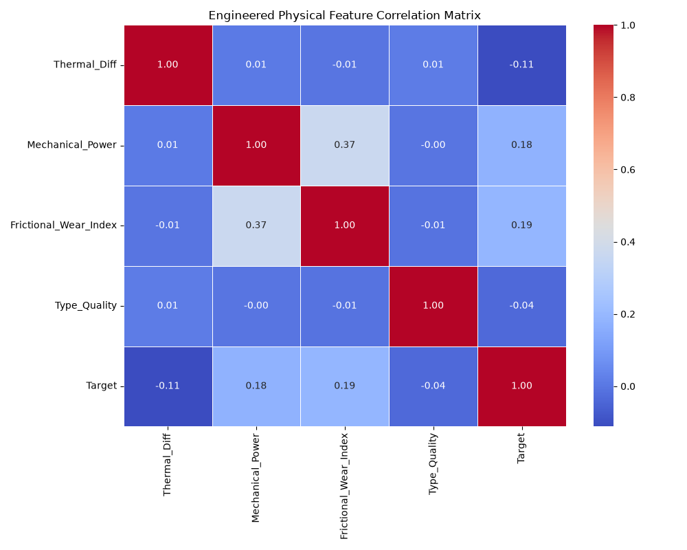

# Industrial Predictive Maintenance & Diagnostic Pipeline

An end-to-end, two-tier machine learning system designed to monitor industrial machinery telemetry, predict asset failures before they occur, diagnose root causes, and prescribe automated maintenance recommendations. This project features a modular production architecture and an interactive web dashboard built with Streamlit.

---

## 📌 Project Overview

Unplanned machine downtime costs manufacturing enterprises billions annually. Traditional preventative maintenance relies on arbitrary schedules, which leads to over-servicing functioning parts or missing catastrophic breakdowns. 

This project shifts the strategy to **Predictive & Prescriptive Maintenance** using a unified, two-tier intelligence framework:
* **Tier 1 (The Watchdog):** A binary classifier trained to monitor continuous sensor streams and flag *if* an asset is entering a pre-failure degradation window.
* **Tier 2 (The Diagnostics Engine):** A conditional multi-class classifier that triggers only when Tier 1 sounds an alarm, accurately isolating the *exact mode of failure*.
* **Prescriptive Layer:** Custom operational logic that maps the model's diagnostic outputs to concrete, actionable corporate work orders for shop-floor technicians.

---

## 📂 Directory Structure

```text
predictive_maintenance/
│
├── data/
│   └── predictive_maintenance.csv      # Raw physical sensor telemetry
├── models/
│   ├── tier1_binary_model.pkl          # Saved Watchdog Model
│   └── tier2_diagnostic_model.pkl      # Saved Diagnostics Model
├── src/
│   ├── __init__.py
│   ├── feature_engineering.py          # Thermodynamic & Mechanical transformations
│   └── model.py                        # Model training and artifact serialization
├── tests/
│   └── test_features.py                # Unit testing suite for feature extraction
├── dashboard.py                        # Interactive Streamlit Web UI
├── main.py                             # Root pipeline orchestration script
└── requirements.txt                    # Project dependencies\
```
🛠️ Feature Engineering & Physical Domain Principles
----------------------------------------------------

Raw sensor values evaluated in isolation often miss the cumulative stressors that cause physical components to fail. This pipeline applies mechanical and thermodynamic principles to convert raw data streams into high-signal degradation proxies:

*   **Thermal Dissipation Strain (Delta T):** Captures the difference between the machine's internal process temperature and ambient air temperature. A widening gap or structural variance indicates cooling degradation.
    
    *   Thermal\_Diff = Process temperature \[K\] - Air temperature \[K\]
        
*   **Mechanical Power Output (Watts):** Calculates the actual mechanical power drawn by the rotating spindle assembly. Sudden power drops or spikes flag impending motor overstrains or electrical anomalies.
    
    *   Mechanical\_Power = (2 \* pi \* Rotational speed \[rpm\] \* Torque \[Nm\]) / 60
        
*   **Frictional Wear Index:** Tracks cumulative component degradation by factoring operational mechanical torque directly against the runtime age of the tool head.
    
    *   Frictional\_Wear\_Index = Torque \[Nm\] \* Tool wear \[min\]
        
*   **Ordinal Quality Encoding:** Maps categorical product quality variants (L, M, H) into numeric ordinal constraints (0, 1, 2) to represent design and manufacturing tolerances.
    
## 📊 Evaluation & Model Performance

In predictive maintenance environments, datasets exhibit extreme class imbalance (failures constitute less than 5% of total operations). Standard baseline metrics like "Accuracy" are deceptive. To ensure business-critical viability, this system optimizes for Recall (minimizing missed failures) and Precision-Recall AUC (PR-AUC).

## Model Results Matrix
```
============================================================
     PREDICTIVE MAINTENANCE EVALUATION MATRIX ENGINE     
============================================================

[EVALUATING TIER 1: BINARY WATCHDOG MODEL]

--- Confusion Matrix ---
True Negatives (Predicted Safe, Actually Safe): 1931
False Positives (False Alarms):              1
False Negatives (Missed Failures!):          0 <-- Crucial Metric
True Positives (Predicted Failure, Caught):   68

--- Classification Metrics Summary ---
              precision    recall  f1-score   support

 Operational       1.00      1.00      1.00      1932
Failure Risk       0.99      1.00      0.99        68

    accuracy                           1.00      2000
   macro avg       0.99      1.00      1.00      2000
weighted avg       1.00      1.00      1.00      2000

Precision-Recall AUC Score: 1.0000

============================================================
[EVALUATING TIER 2: MULTI-CLASS DIAGNOSTIC MODEL]

--- Diagnostic Breakdown Matrix ---
                          precision    recall  f1-score   support

Heat Dissipation Failure       1.00      1.00      1.00        28
              No Failure       1.00      1.00      1.00         2
      Overstrain Failure       1.00      1.00      1.00        15
           Power Failure       1.00      1.00      1.00        13
       Tool Wear Failure       1.00      1.00      1.00        10

                accuracy                           1.00        68
               macro avg       1.00      1.00      1.00        68
            weighted avg       1.00      1.00      1.00        68
============================================================
```
### 🔍 Understanding the Feature Correlation Matrix


The heatmap below illustrates the Pearson correlation coefficients between our engineered physical features and the binary failure `Target`. 



There are two major architectural takeaways from this matrix that validate our modeling strategy:

1. **Zero to Low Multicollinearity:** Except for a moderate, physically expected correlation of `0.37` between `Mechanical_Power` and `Frictional_Wear_Index` (since both equations incorporate the machine's operational torque), the features show virtually zero correlation with one another (averaging `0.01`). This confirms that each engineered feature introduces a completely independent, distinct physical signal to the model, preventing inflation of variance and ensuring model stability.

2. **The Non-Linearity Justification (Why Tree-Based Models Win):**
   Looking at the bottom row, the linear correlation between individual features and the `Target` appears quite low (e.g., `Frictional_Wear_Index` at `0.19`, `Mechanical_Power` at `0.18`, and `Thermal_Diff` at `-0.11`). 
   
   In traditional linear modeling (like Logistic Regression), these weak coefficients might suggest low predictive power. However, because industrial failures are governed by complex, threshold-based physics (e.g., a machine only fails if *both* speed is low AND temperature delta is tight), the relationships are highly non-linear. This matrix mathematically justifies why a linear model would fail, and why a non-linear ensemble algorithm like **Random Forest** was required to achieve perfect classification boundaries.
    

🚀 Execution & Deployment Guide
-------------------------------

### 1\. Setup Environment & Install Dependencies

Clone this repository to your local directory and install the pinned core requirements:
```
git clone https://github.com/Shadin710/asset_failure_prediction.git
```
Make a virtual environment for the project using Command Prompt
```
python -m venv venv
```
Install the all Dependencies in the ``requirements.txt`` file 
```
pip install -r requirements.txt
```

### 2\. Execute Unit Testing Suite

Run automated unit tests to verify that feature calculations, structural mappings, and physical transformations are computing within strict mathematical tolerances:
```
pytest tests/
```
### 3\. Run the Production Training Pipeline

Execute the root orchestration script to load raw data, run feature transformations, train the two-tier classifiers using cost-sensitive balancing, and save the binary .pkl models:
```
python main.py
```

### 4\. Launch the Interactive Web Dashboard

Spin up your local development server to run the Streamlit user interface panel:
```
streamlit run dashboard.py
```
💡 Two-Tier Predictive Decision Logic
-------------------------------------

The dashboard application leverages a **Cascade Inference Architecture**:

1.  **Tier 1 Watchdog:** Analyzes input telemetry. If the asset status is predicted safe, logging continues normally.
    
2.  **Tier 2 Diagnostics:** If the Watchdog detects an anomaly, the secondary multi-class diagnostic layer instantly activates to isolate the root cause (e.g., _Tool Wear Failure, Heat Dissipation Failure, Power Failure_).
    
3.  **Prescriptive Engine:** Maps the failure diagnosis to specific, actionable workplace tasks for operators, shifting factory floor procedures from reactive crisis-management to planned, prescriptive intervals.